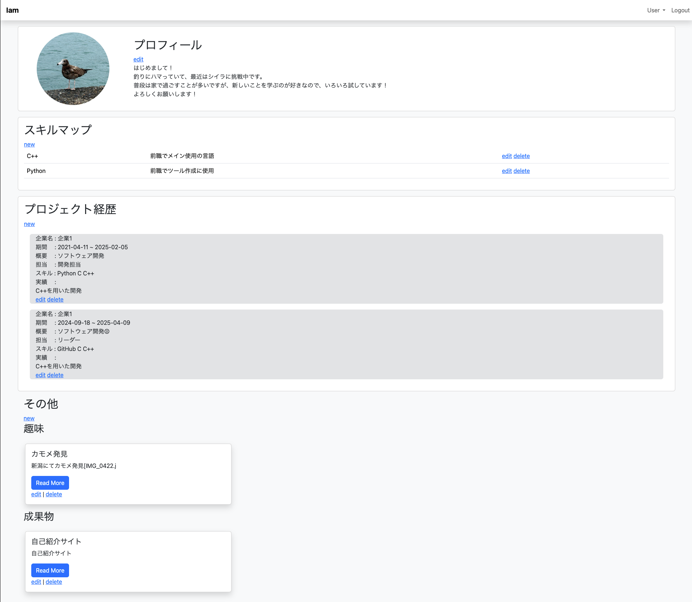
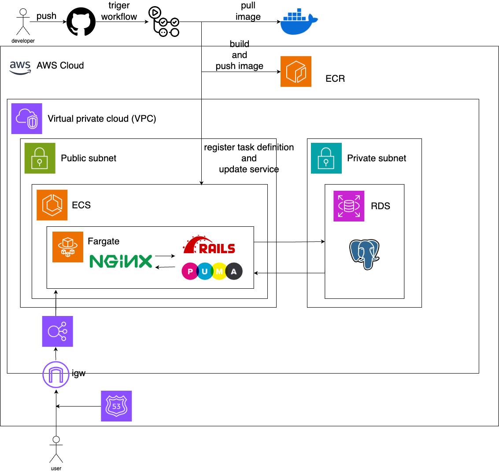

# README

# ポートフォリオ
私の自己紹介サイトです。
Ruby on RailsやAWSを用いた開発の実験ラボも兼ねています。

# 機能一覧
|ホーム画面|ログイン画面|
|---|---|
|ホーム画面。|ログインIDとパスワードからログイン処理。自動ログイン機能処理を実装。|
|||

|ポスト一覧|ポスト投稿|
|---|---|
|カテゴリごとにポストが表示。editとdeleteは管理者権限を持つユーザーのみに表示。|リッチテキストエディタを実装(写真の投稿も可)。カテゴリの追加のハイパーリンクからカテゴリの追加が可能。|
|||

|ポスト詳細|ポスト編集|
|---|---|
|カテゴリ、タイトル、本文の表示。|管理者のみポストの編集が可能。|
||

|ユーザー一覧|ユーザー詳細|
|---|---|
|管理者のみアクセス可。それぞれのハイパーリンクから処理が可。||
|||

|ユーザー追加|ユーザー詳細|
|---|---|
|||

# 使用技術
|Category|Technology Stack|
|---|---|
|Frontend|Bootstrap|
|Backend|Ruby, RubyonRails, Puma, Nginx|
|Infrastructure|AWS(後述)|
|Database|Postgres|
|Environment setup|Docker|
|CI/CD|GithubActions|

# 構成図

# 機能一覧
 - ログイン(自動ログイン機能)/ログアウト
 - ポスト投稿機能(リッチテキスト)
 - ユーザー管理機能

# 画面遷移図

